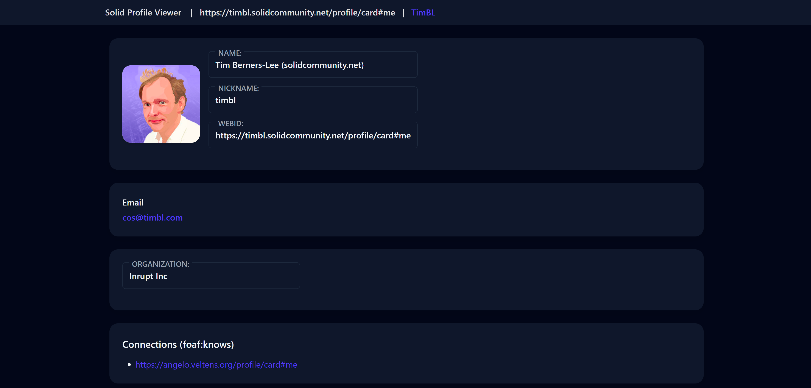

# 🔗 Solid WebID Profile Viewer

A simple React application for viewing **Solid WebID profiles**.  
Built with **React + TypeScript + TailwindCSS**, using [`rdflib.js`](https://github.com/linkeddata/rdflib.js) for parsing RDF profiles.

---

## ✨ Features

- Display user profile by **WebID**
- Show:
    - 👤 Profile image
    - 🏷️ Name & nickname
    - ✉️ Emails
    - 📞 Phone numbers
    - 🏢 Organization & title
    - 🏠 Homepage
    - 📝 Short bio
    - 🔗 Connections (`foaf:knows`)
- Toast notifications for loading, success, and errors
- Responsive Material-like UI (cards, dividers, header)

---

## 🚀 Getting Started

### 1. Clone repository
```bash

git clone https://github.com/Sedancer/solid-webid-profile-viewer.git
cd solid-webid-profile-viewer
```
### 2. Install dependencies & Run development server
```bash

npm install
npm run dev
```
⚙️ Configuration

By default the app loads Tim Berners-Lee's WebID
```bash
App.txs
...
const DEFAULT_WEBID = "https://timbl.solidcommunity.net/profile/card#me";
```

To view another profile, just change the URL query parameter:
http://localhost:5173/?webid=https://example.org/profile/card#me


🧩 Tech Stack

- React 18 + TypeScript
- Vite (dev server & bundler)
- TailwindCSS (styling)
- rdflib.js (RDF parsing)

## 📸 Screenshots

Example profile page:

